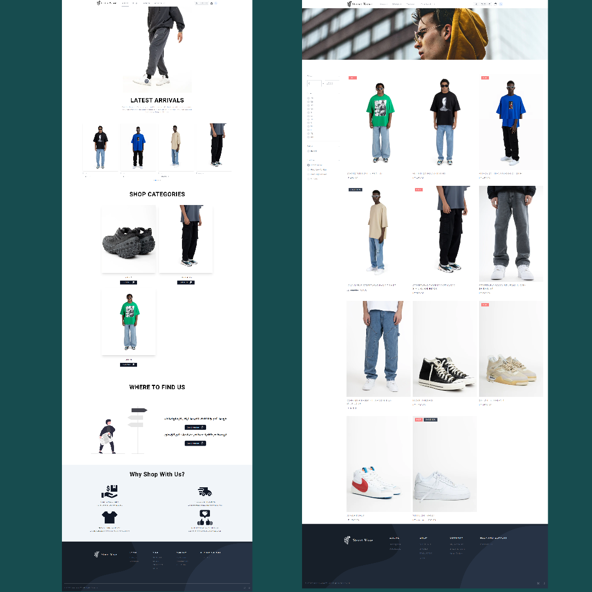
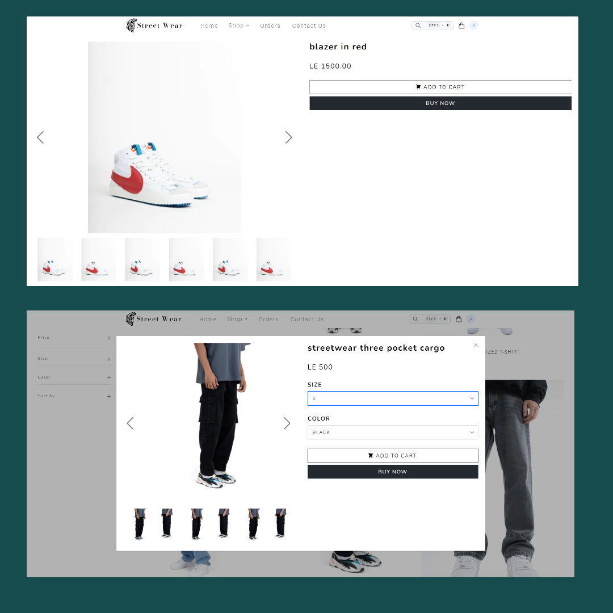
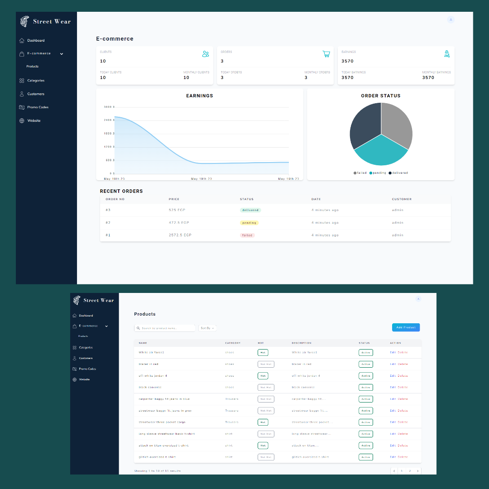

## Project overview

Streetwear E-commerce is a Laravel-based e-commerce project that offers a seamless shopping experience for customers and a comprehensive administration panel for store owners. The project aims to provide a modern and efficient e-commerce solution by leveraging the power of various technologies and libraries.

# Hi, I'm Anas! 👋

I'm a full stack web developer passionate about
creating interactive applications and experiences on
the web.

## Getting Started

To get started with Streetwear E-commerce, follow these steps:

#### Create a database: Create a database for your project and make a note of the database name.

---

Configure the environment: Duplicate the .env.example file and rename it to .env. Open the .env file and update the following line with your database information:

```bash
  DB_DATABASE=your_database_name

```

Install Laravel dependencies: Open a terminal in the project directory and run the following command to install the Laravel dependencies:

```bash
  composer install
```

Install NPM packages: While still in the terminal, run the following command to install the required NPM packages:

```bash
  npm install
```

```bash
  npm run dev
```

Migrate the database: Run the database migrations to create the necessary tables in your database, and seeding the database with dumpy data(products, categories, users).

```bash
 php artisan migrate --seed
```

Start the development server: Run the following command to start the development server:

```bash
 php artisan serve
```

## Key Features

-   Separate Admin and Customer Dashboards: The project provides distinct dashboards for administrators and customers to perform their respective tasks efficiently.
-   Comprehensive Admin Panel: Administrators have full control over the store, including managing products, viewing store analytics, handling orders, and creating/deleting promo codes.
-   User-friendly Interface: The project focuses on providing a user-friendly interface to enhance the overall shopping experience.
-   Integration with Laravel Jetstream: The project leverages Laravel Jetstream for secure authentication and user management
-   Responsive Design: The project utilizes Tailwind CSS and the Flowbite library to ensure a responsive design that adapts to different devices.

## 🛠 Skills

-   HTML, CSS,
-   tailwindcss, Flowbite
-   JavaScript, JQuery,
-   livewire, PHP, Laravel,
-   MYSQL

## 🔗 Links

[](https://www.linkedin.com/in/anas-elnahef-10074021b/)

## Screenshots

-   #### To view all individual screenshot open the 'screenshots' folder in the root folder

#### _Home and Products Pages_



#### _Orders and Cart Pages_



#### _Dashboard and products Admin Pages_



## License

[MIT](https://choosealicense.com/licenses/mit/)
